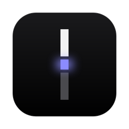
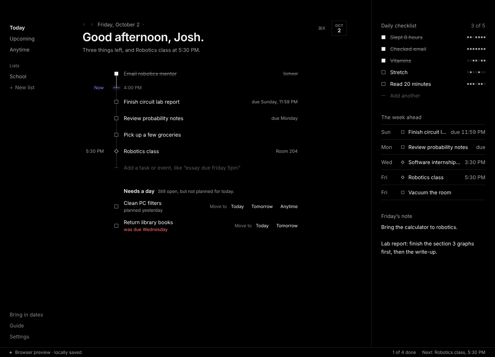
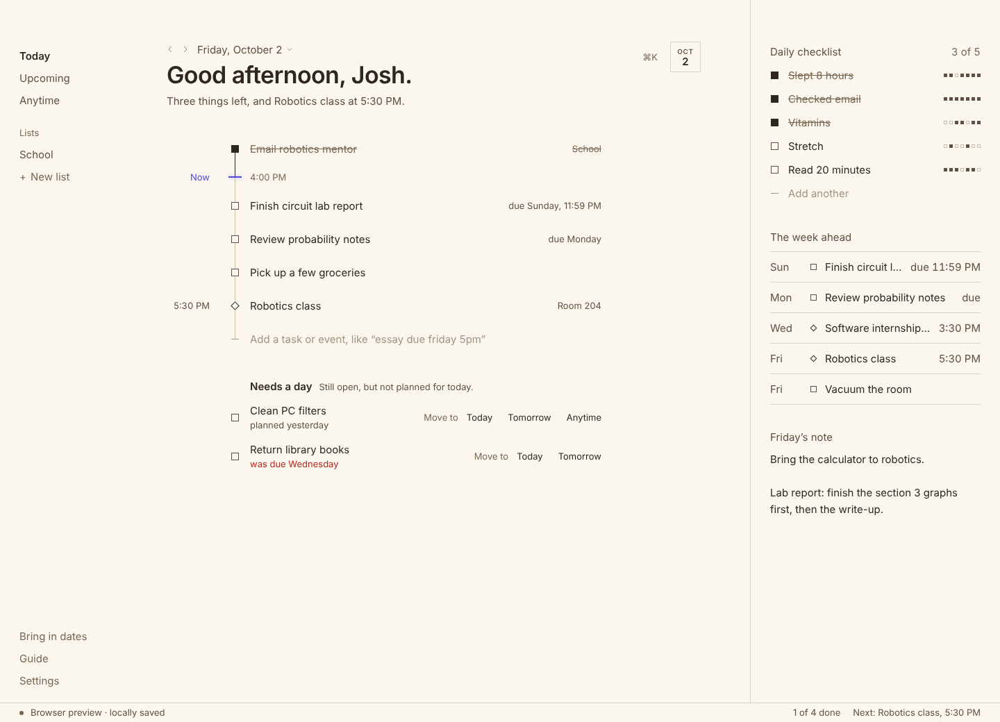
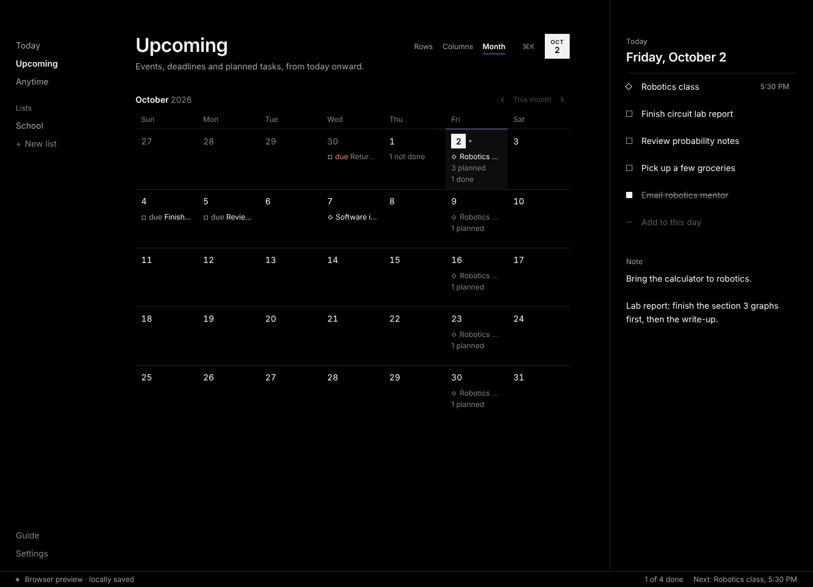
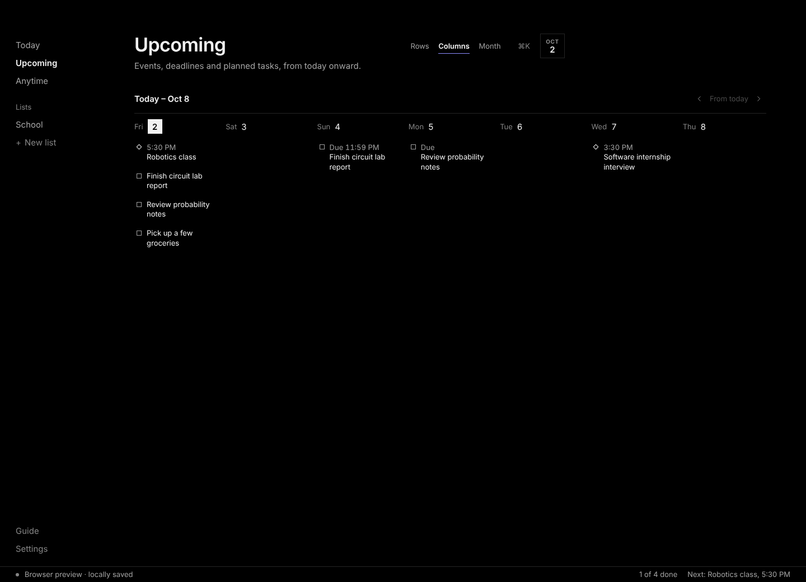
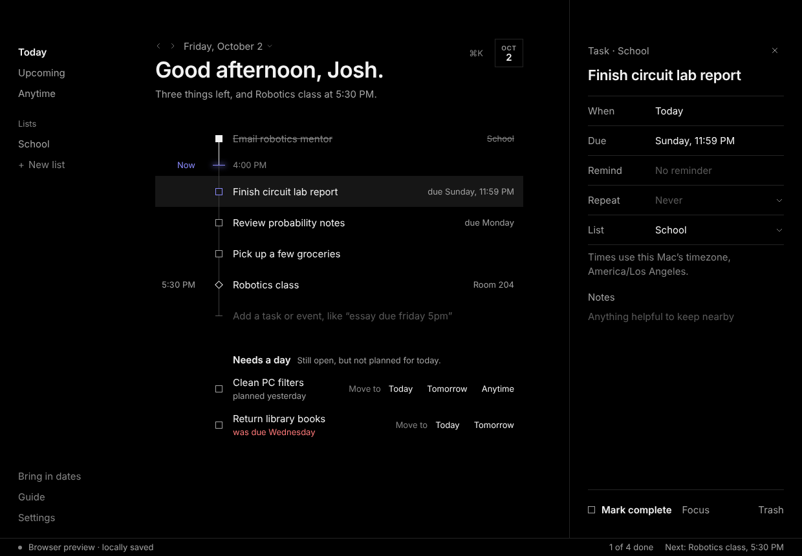
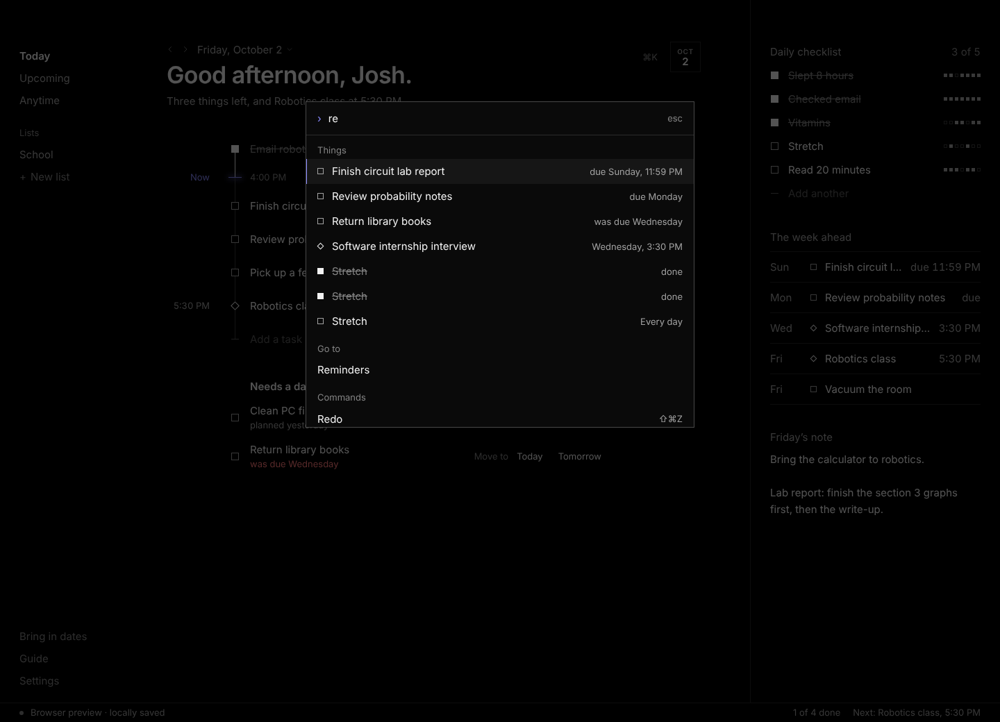
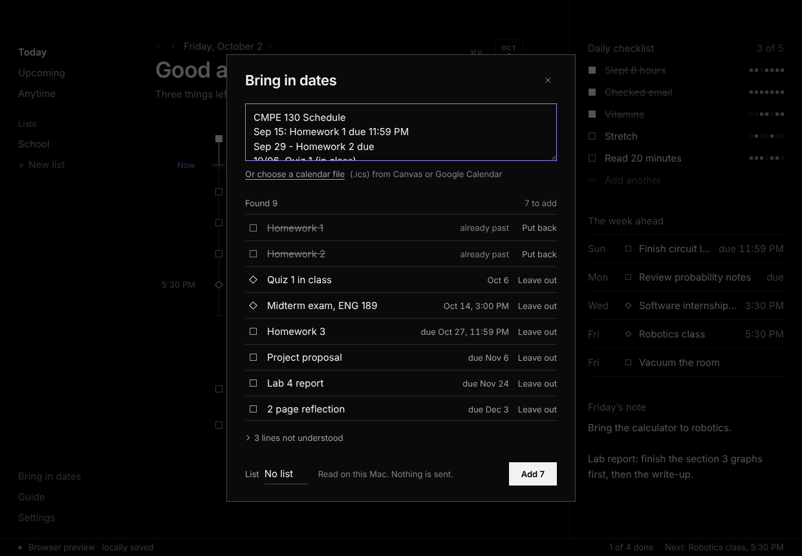

# Daily Organizer

Daily Organizer is a Mac app I made for my own assignments, deadlines, events
and daily routines. I had given up on other organizers for the same three
reasons each time: adding things took too much effort, the app never felt like
mine, and I forgot it existed. I wanted to see whether a different design
could remove those problems instead of working around them.

The main idea is that **today is one line**. What I have finished sits above a
mark for the present moment. What is left hangs below it, with events at their
times.

The app can:

- Read a line typed the way I would say it, such as `essay due friday 5pm`
- Read a whole pasted syllabus, or a calendar file from Canvas or Google
  Calendar, and add every deadline and exam at once
- Keep the day I plan to work on something separate from the day it is due
- Repeat tasks and events, including "every other Friday" and "the fourth
  Wednesday of each month"
- Show what is coming as rows, as seven day columns, or as a month
- Open any date as the same line that today is, to plan it or to look back
- Move a task or an event to another day by dragging it there
- Keep a daily checklist (slept 8 hours, checked email) that clears each
  morning and stays out of the day's count
- Hold a missed task until I decide where it goes, without moving its deadline
- Schedule reminders with macOS so they still arrive after the app is quit
- Take back any change with Cmd+Z, and bring it back with Shift+Cmd+Z
- Store everything in a local SQLite database, with daily backups

There are no accounts and no network requests. All data stays on the Mac.

## Download

The app is on the [Releases page](https://github.com/joshuajyi/daily-organizer/releases/latest)
as a disk image, for macOS 13 or later.

1. Open the disk image and drag Daily Organizer onto Applications.
2. Open it. macOS will say it could not verify the app. That is because the
   download is not notarized by Apple, which needs a paid developer account.
   Click Done, then open System Settings, go to Privacy & Security, scroll
   down and click **Open Anyway**. This is only needed the first time.
3. Enter your access code. Message me if you would like one.

The code is asked for once. It is checked on your Mac, against a list built
into the app, and nothing is sent anywhere to do it. There is no account and no
sign-in, and everything you add stays on your computer.

## Screenshots

Today in Nightfall. A square is a task and a diamond is an event. The daily
checklist at the top right holds what I ask myself every day. "Needs a day"
under the line holds anything still open that is not planned for today.

The same day in Daylight.

| Month | Columns | Details |
|---|---|---|
|  |  |  |

Cmd+K finds any task or event, jumps to a view, or runs a command.

A syllabus pasted into the app. Each line that carries a date is shown as what
it will become before anything is added. Two deadlines that have already
passed start left out, and three lines of prose are counted as not understood
instead of being guessed at.

The screenshots use example data, not my own tasks. They were taken from the
app's browser preview on Linux, where a stand-in font replaces the Mac system
font, so the installed app looks slightly different.

## What typing looks like

Adding something is one field. The app reads the date, the time, the repeat and
the list out of the sentence and shows what it understood before I press
Return.

| I type | It becomes |
|---|---|
| `start essay monday` | A task planned for Monday |
| `essay due friday oct 16 5pm` | A task due Friday, October 16 at 5:00 PM |
| `essay tomorrow due friday` | A task planned for tomorrow, due Friday |
| `call dentist tomorrow 3pm` | An event tomorrow at 3:00 PM |
| `robotics club every wednesday 5pm` | An event that repeats every Wednesday |
| `club meeting every fourth wednesday` | A task on the fourth Wednesday of each month |
| `laundry every other sunday` | A task every two weeks on Sunday |
| `vitamins every day` | An item on the daily checklist |
| `lab report due sunday 11:59pm school` | A task with a deadline, filed in my School list |
| `SAT prep` | A task called "SAT prep" (not Saturday) |

The last row matters as much as the others. A parser that guesses too eagerly
is worse than no parser, so short weekday names only count after a word like
`due`, `on` or `next`, and "weekly" only counts next to a real day or time.

This uses plain rules. There is no AI model and no network call in the app.

## A semester in one paste

The same reader works on many lines at once. "Bring in dates" in the left
column opens a place to paste them, and pasting several lines anywhere in the
app opens it too.

| A line in the syllabus | It becomes |
|---|---|
| `Sep 15: Homework 1 due 11:59 PM` | A task due September 15 at 11:59 PM |
| `Oct 14 — Midterm exam, 3:00pm, ENG 189` | An event on October 14 at 3:00 PM |
| `Homework 3 (due Oct 27 at 11:59pm PST)` | A task due October 27 at 11:59 PM |
| `Project proposal due: Friday, Nov 6` | A task due November 6 |
| `Final exam: December 15, 2026 at 9:45 AM` | An event on December 15 at 9:45 AM |
| `Week 1 (Aug 24 – Aug 28): Introduction` | Not understood, and listed as such |
| `Late work loses 10% per day.` | Not understood, and listed as such |

A span of days is set aside on purpose. Which end of "Aug 24 to Aug 28" is the
deadline would be a guess, and a wrong guess puts something on the wrong day
without my noticing.

A calendar file (.ics) is read the same way. Canvas exports each assignment
as an event at the moment it is due, so those become tasks with deadlines. A
class that meets Monday and Wednesday becomes two weekly events. Bringing the
same file in a week later adds only what is new.

## The rules behind the screen

Most of the work was deciding what the app should refuse to do.

1. **Planned and due are different dates.** Moving the day I plan to do
   something never changes its deadline.
2. **Today only shows what I chose for today.** A missed task does not pile
   onto the line. It waits in "Needs a day" with one question, "Move to", and
   three equal answers: Today, Tomorrow, or Anytime.
3. **Repeats do not create a backlog.** Finishing one sets up the next. A
   repeating event I never ticked off moves to its next date by itself. The
   daily checklist simply clears each morning.
4. **Only two marks.** A square is a task and a diamond is an event, everywhere
   in the app. A dashed mark is a later occurrence of something that repeats.
5. **Dates are words.** In the details, a date reads "Sunday, 11:59 PM" and is
   changed by typing `fri 5pm`. There are no date pickers.

[docs/DESIGN.md](docs/DESIGN.md) explains these choices and the complaints
about other apps that led to them.

## How it is built

- **Tauri 2** wraps the app. It uses the Mac's own WebKit instead of bundling
  a browser, which keeps the app small.
- **React 19 and TypeScript** draw the interface. TypeScript runs in strict
  mode.
- **Rust with SQLite** stores the data. Every save is one transaction that
  first checks a revision number, so an out-of-date window cannot overwrite
  newer data. The previous 20 states are kept for recovery, and one backup
  file is written per day for seven days.
- **An Objective-C bridge** talks to macOS for notifications and opening at
  login. Reminders are handed to the system, so they fire after the app quits.
- **Node's built-in test runner** runs the unit tests with no extra framework.
- **Playwright** drives a real browser through the interface for the
  end-to-end check.

The date rules, the parser and the repeat rules are plain TypeScript functions
with no dependency on React or Tauri. That is what makes them testable without
opening a window.

[docs/ENGINEERING.md](docs/ENGINEERING.md) goes through the data model, the
time handling, the parser, repeats, storage and testing in more detail.

## Testing

| What | Count | Covers |
|---|---:|---|
| Bringing dates in | 7 tests | A syllabus read line by line with the exact result checked; a calendar file with all-day, UTC and other-zone times, repeats and an ended series; a second import adding only what is new; damaged files |
| Undo and redo | 6 tests | Exact restore; typing merged into one step; decisions never merged; the step limit |
| Date and repeat rules | 21 tests | Planned, due and reminder staying independent; daylight-saving gaps and repeats; month-end and leap-day repeats; intervals and "Nth weekday"; skipping; moving to another day; ticking and unticking the daily checklist and its week of history; rejecting bad imports |
| Access codes | 4 tests | The built-in SHA-256 against Node's at every block boundary; reading a code however it is typed; accepting only issued codes |
| Typed-line parser | 18 tests | Dates, times, lists and repeats in different word orders; words that must not be read as dates |
| Summaries and day files | 3 tests | The morning summary sentence and the Markdown page for a day |
| SQLite store (Rust) | 4 tests | Reopening, refusing a stale save, keeping the old state when a save is rejected, backup rotation |
| Interface check | 1 scripted run | A real browser is driven through adding, completing, repeats, all three Upcoming layouts, pasting a syllabus, undo and redo, the keyboard, backup and restore, a deliberate crash and recovery, and layout at two window sizes |

The interface check also guards things that are easy to break without
noticing. It fails if a type size outside the app's fixed scale appears on
screen, or if the Rows / Columns / Month switch moves by even one pixel
between layouts.

Reminders are different. Whether macOS delivers an alert while the app is
closed can only be checked by hand on a Mac, so that is a written checklist
rather than an automated test.

## Problems I ran into

**A date that was read as two dates.** I typed `essay due friday oct 16` and
the preview said "Planned Oct 16, Due Oct 9". The parser had matched `friday`
and `oct 16` as two separate dates: it took "due friday" as the coming Friday
and treated "oct 16" as the day I planned to start. The fix was to treat a
weekday said together with a date as one date, and let the date decide when
the two disagree. That exact sentence is now a test.

**A heading that jumped sideways.** Switching Upcoming between Rows and
Columns moved the buttons at the top. There were two causes. The selected
word turns bold and gets wider, which nudged its neighbours, and a long Rows
list showed a scrollbar that took 15 pixels the short Columns view did not.
The fix reserves the bold width for every word and keeps the scrollbar's
space whether or not one is showing. The second cause only appears when macOS
is set to always show scrollbars, which it does when a mouse is connected, so
it never showed up in the automated check until I measured for it.

**An update that did not seem to arrive.** Closing the window hides the app
so that reminders and the Dock count keep working. That also meant installing
a new build kept showing the old one, because the old copy was still running.
The install script now asks the running copy to quit before replacing it.

## Limitations

- It runs on macOS only. The download is not notarized, so macOS asks for an
  extra approval the first time it is opened.
- The access code is a gate, not a lock. A code can be passed on, and it does
  not protect the data on the Mac.
- There is no sync and no phone version. A calendar file can be brought in,
  but that is a one-time read, not a live connection.
- The syllabus reader works on lines that carry their own date. A syllabus
  written as paragraphs, or as a table of week numbers with no dates, is
  mostly set aside.
- An alert at an exact time needs the Mac to be on and awake, and Focus modes
  can silence it.
- The parser understands English and US-style dates.
- "The last Friday of the month" is not supported yet. The first through
  fourth are.
- Opening at login, the global shortcut and the per-day Markdown files have
  had less testing than the rest of the app.

## Source

The source code is in a private repository. I am happy to walk through any
part of it. This repository holds the project description, the design and
engineering notes, and the screenshots.

## Development note

I built this with Claude as a coding assistant. My part was the product: 
deciding what the app is for, setting the rules above, going through two 
earlier designs before this one, and using each build on my Mac to find what 
was confusing or broken. The three problems described above all came from 
that testing. I am now working through the code myself so that I can extend 
it without help.

## References

- [Tauri 2 documentation](https://v2.tauri.app/)
- [SQLite: write-ahead logging](https://www.sqlite.org/wal.html)
- [Apple: UNUserNotificationCenter](https://developer.apple.com/documentation/usernotifications/unusernotificationcenter)
- Two Hacker News discussions about why people give up on to-do apps:
  [one](https://news.ycombinator.com/item?id=44864134) and
  [two](https://news.ycombinator.com/item?id=28029809)
